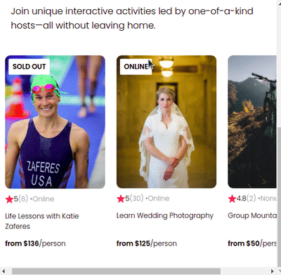

# Create React Airbnb App
In this project An airbnb experience page clone is created to learn and implement React props concepts.

### Objectives

- [x] Learn about props
- [x] Learn abouts Data Flow through Props
- [x] Use Array maps with JSX to create mutiple compnonents with different data
- [x] Conditioning on HTML elements according to props Data
- [x] Learn about react-creat-app and use it to create a react project from scratch

### Demo

### Run App
- $ npm start
- Open [http://localhost:3000](http://localhost:3000) to view it in your browser.

